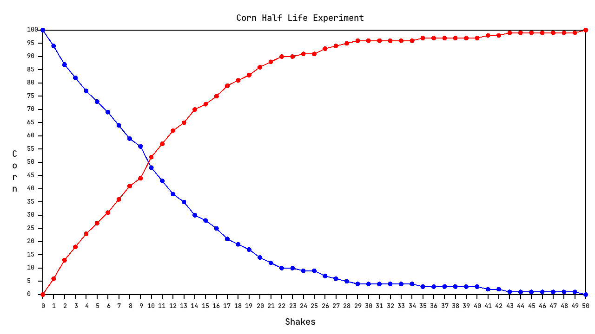

# JPlotter

JPlotter is a very small plotting library for making graphs for school. 
The only library it depends on is JovialEngine, my personal engine for multi-media applications. 
However, JovialEngine is currently closed to public use so building and using the project is currently impossible without 
access granted by me.

## Example

